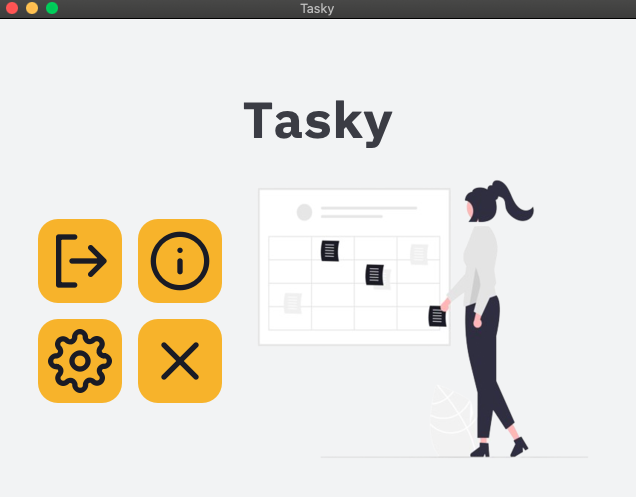
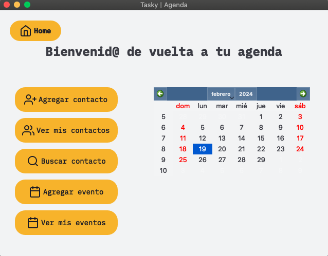

# Tasky

A minimal open source desktop planner, developed in C++ and QT.


## Developed by

- [@pol-cova](https://github.com/pol-cova)


## Features

- Add/View Contacts
- Search Contacts 
- Add/View Events

## Future Features

- Add/View Remainders
- Local Storages to set preferences

## Run Locally

Clone the project

```bash
  git clone https://github.com/pol-cova/Tasky
```

Go to the project directory

```bash
  cd tasky
```

Running with qmake 

```bash
  qmake -makefile -o Makefile "CONFIG+=test" tasky.pro
```


## Screenshots







